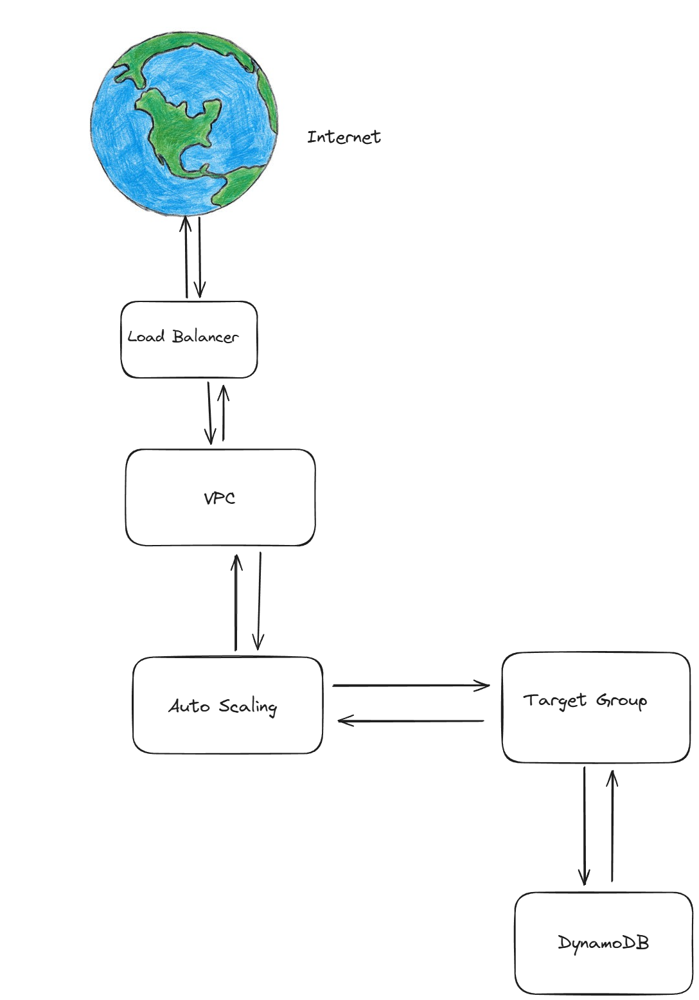
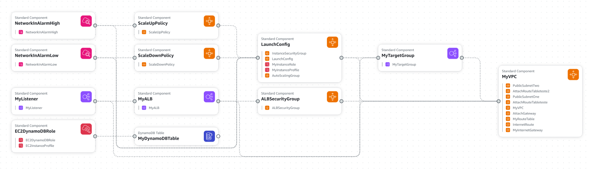

## Descrição do Projeto

O projeto tem como objetivo a criação de uma infraestrutura utilizando a ideia de IaC (Infrastructure as a Code) na AWS. Para isso, foi utilizado a biblioteca awscli e CloudFormation, a ferramenta da Amazon para IaC. O projeto possui um aplicativo para demonstrar funcionamento CRUD do DynamoDB, Auto Scaling com base na quantidade de pacotes/requisições que os servidores estão recebendo.

## Resumo dos componentes princpais

1. **EC2**: A instância EC2 é uma máquina virtual na nuvem da AWS. Nesse projeto, ela é será responsável por executar a aplicação web e salvar no banco de dados. A instância EC2 estará dentro de um Auto Scaling Group (ASG) para garantir alta disponibilidade e escalabilidade automática.

2. **Auto Scaling Group (ASG)**: O Auto Scaling Group um componente que vai equilibrar a oferta de recursos do TargetGroup (instâncias EC2) para fins de dimensionamento automático e aplicação de políticas. As políticas do Auto Scaling para aumentar ou diminuir a oferta de recursos está atrelada aos alarmes setados no CloudWatch.

3. **CloudWatch**: O Amazon CloudWatch é um serviço de monitoramento e observabilidade da AWS para recursos em nuvem e aplicativos executados na AWS. O CloudWatch será utilizado para monitorar as instâncias EC2.

4. **Application Load Balancer**: O Application Load Balancer (ALB) é um balanceador de carga gerenciado pela AWS, projetado para aplicativos HTTP e HTTPS. O ALB roteia o tráfego de entrada para instâncias EC2, contêineres do Amazon ECS e funções do AWS Lambda, com base nas regras definidas pelo usuário. Neste projeto, o ALB também foi configurado com "Health Checks" para verificar a integridade das instâncias EC2 e removê-las do balanceamento de carga se estiverem inativas.

5. **DynamoDB**: O Amazon DynamoDB é um serviço de banco de dados NoSQL totalmente gerenciado que oferece desempenho rápido e previsível com escalabilidade contínua. O DynamoDB é um banco de dados sem servidor, o que significa que não há servidores para gerenciar, provisionar ou manter, nem software para instalar, manter ou operar.


<p align="center"><b style="font-size: 24px;"><u>Topologia da solução</u></b></p>
<p align="center">
  
</p>


<p align="center"><b style="font-size: 24px;"><u>Diagrama da Arquitetura AWS </u></b></p>
<p align="center">
  
  <p align="center"><style="font-size: 14px;">Diagrama feito com uma das ferramentas disponibilizadas pela AWS</p>
</p>


## Tecnologias usadas

### AWS
* A Amazon Web Services (AWS) é uma plataforma de computação em nuvem oferecida pela Amazon.com, composta por diversos serviços de computação. Esses serviços são disponibilizados em várias regiões geográficas ao redor do mundo.

### AWS CLI
* O AWS Command Line Interface (AWS CLI) é uma ferramenta unificada para gerenciar serviços da AWS. Com uma única ferramenta para download e configuração, você pode controlar vários serviços da AWS a partir da linha de comando e automatizar tarefas por meio de scripts.

### AWS VPC
* O Amazon Virtual Private Cloud (Amazon VPC) permite que você crie uma rede virtual na AWS sem a necessidade de VPN, hardware ou datacenter físico. Você pode controlar sua própria rede virtual, incluindo a seleção do intervalo de endereços IP, criação de sub-redes e configuração de tabelas de roteamento e gateways de rede.

### AWS ALB
* O Application Load Balancer (ALB) é um balanceador de carga gerenciado pela AWS, projetado para aplicativos HTTP e HTTPS. Operando na camada 7, o ALB roteia o tráfego de entrada para alvos como instâncias do Amazon EC2, contêineres do Amazon ECS e funções do AWS Lambda, com base nas regras definidas pelo usuário. Neste projeto, o ALB também foi configurado com "Health Checks" para verificar a integridade das instâncias EC2 e removê-las do balanceamento de carga se estiverem inativas.

### AWS TAR
* O Amazon Target Group (TAR) é um componente do Elastic Load Balancing que define um grupo de destinos para roteamento de solicitações de tráfego. Você pode registrar instâncias EC2, contêineres do Amazon ECS ou funções do AWS Lambda como destinos em um Target Group. O Target Group é usado por um balanceador de carga para rotear solicitações de tráfego para os destinos registrados.

### AWS ASG
* O Auto Scaling Group (ASG) é um grupo de instâncias do Amazon EC2 que podem ser gerenciadas como uma unidade lógica para fins de dimensionamento automático e aplicação de políticas. Um ASG garante que o número especificado de instâncias do EC2 esteja sempre em execução.

### AWS CloudWatch
* O Amazon CloudWatch é um serviço de monitoramento e observabilidade da AWS para recursos em nuvem e aplicativos executados na AWS. Ele permite coletar e rastrear métricas, monitorar arquivos de log e definir alarmes. Neste projeto, o CloudWatch foi utilizado para monitorar o status do ASG e das instâncias EC2.

### AWS EC2
* O Amazon Elastic Compute Cloud (Amazon EC2) é um serviço web que oferece capacidade de computação redimensionável na nuvem. Foi projetado para facilitar a computação em nuvem em escala web para desenvolvedores.

### AWS DynamoDB
* O Amazon DynamoDB é um serviço de banco de dados NoSQL totalmente gerenciado que oferece desempenho rápido e previsível com escalabilidade contínua. O DynamoDB é um banco de dados sem servidor, o que significa que não há servidores para gerenciar, provisionar ou manter, nem software para instalar, manter ou operar.

### AWS IAM
* O AWS Identity and Access Management (IAM) é um serviço da AWS que ajuda a controlar o acesso a recursos da AWS. Ele permite que você gerencie usuários e grupos de usuários e conceda permissões para permitir ou negar o acesso a recursos da AWS.


## Pré-requisitos

Para executar o projeto, é necessário ter o AWS CLI instalado. Para instalar o AWS CLI, siga as instruções no site oficial: https://docs.aws.amazon.com/cli/latest/userguide/install-cliv2.html.

Após a instalação do AWS CLI, configure-o com as credenciais de acesso da sua conta AWS usando o comando abaixo e siga as instruções:

```bash
aws configure
```

## Execução do Projeto

Com tudo configurado, acesse o serviço de CloudFormation da AWS e crie um novo stack. Selecione o arquivo .yaml presente na pasta raiz do projeto e siga as instruções para utilizar o template de criação da arquitetura.

### Criação do Stack

```bash
chmod +x start.sh
./start.sh
```
Com esses 2 comandos é possível deixar o script executável, e executar o script que cria a stack.

Após alguns minutos a stack estará criada e será possível acessar a aplicação através do link que será gerado no output da stack.

### Atualização da Stack

```bash
chmod +x update.sh
./update.sh
```
Esse comando atualiza a aplicação, caso seja necessário. Para usar esse comando é necessário que a stack já tenha sido criada. 

O comando também só funcionará se houver mudanças no .yaml, caso contrário, não haverá atualização.

### Exclusão da Stack

```bash
chmod +x stop.sh
./stop.sh
```
Esse comando exclui a stack criada. Para usar esse comando é necessário que a stack já tenha sido criada.

### Obtenção do DNS

```bash
chmod +x get_dns.sh
```
Esse comando retorna o DNS do ALB. Para usar esse comando é necessário que a stack já tenha sido criada.

### Teste da Aplicação

Para testar a aplicação, você pode usar o comando curl para enviar requisições HTTP para a API RESTful. Abaixo estão alguns exemplos de comandos curl para testar as funcionalidades CRUD da aplicação:

1. **Já existe um script que faz todos os testes de forma automatica**

```bash
python3 teste_app.py
```
Esse comando executa um script que faz os testes de CRUD na aplicação. Para usar esse comando é necessário que a stack já tenha sido criada.

2. **Criar um novo item**:

```bash
curl -X POST -H "Content-Type: application/json" -d '{"id": "<ID>", "name": "<NAME>"}' <ALB-DNS>/add_user
```

3. **Obter um item existente**:

```bash
curl -X GET "<ALB-DNS>/get_user?user_id=<ID>"
```

4. **Atualizar um item existente**:

```bash
curl -X PUT <ALB-DNS>/update_user -H "Content-Type: application/json" -d '{"id": "<ID>", "name": "<NAME>"}' 
```

5. **Excluir um item existente**:

```bash
curl -X DELETE <ALB-DNS>/delete_user?user_id=<ID>
```

Substitua `<ID>`, `<NAME>` e `<ALB-DNS>` pelos valores desejados.


## Escolha da região
A região escolhida para a execução do projeto foi sa-east-1. A seleção foi baseada na latência e no custo dos serviços. A região sa-east-1 fica localizada em São Paulo, proporcionando menor latência para os usuários brasileiros, além de possuir preços competitivos em relação a outras regiões.

## Projeção de custos do projeto
Para estimar os custos associados à arquitetura proposta, utilizamos o AWS Cost Calculator. Esta ferramenta permite modelar e comparar os custos de diferentes configurações de serviços AWS, ajudando a tomar decisões informadas sobre escalabilidade e custo-benefício.
Os principais custos são associados ao DynamoDB e ao Elastic Load Balancer, que são os serviços mais caros da aplicação. Abaixo estão os custos estimados para a aplicação proposta:

1. **DynamoDB**:DynamoDB: $26,39 por/mês (1 table with 1GB of storage)
2. **Elastic Load Balancer**: Elastic Load Balancer: $16,44 per/month (1 Application Load Balancer)

Para mais informações sobre os custos dos serviços AWS, consulte o arquivo : [Estimativa de Custos AWS](https://github.com/MatheusCastellucci/App-Cloud/blob/main/imgs/My%20Estimate%20-%20Calculadora%20de%20Pre%C3%A7os%20da%20AWS.pdf)


## Teste de carga
Para testar a escalabilidade da aplicação, foi utilizado a ferramenta Locust. O teste de carga foi realizado com 1000 usuários simultâneos, cada um realizando 1000 requisições HTTP GET para a aplicação. O teste foi realizado por 10 minutos e os resultados foram analisados para verificar a escalabilidade da aplicação e sua resposta.

<p align="center"><b style="font-size: 24px;"><u>Teste de Carga</u></b></p>
<p align="center">
  
  <p align="center"><style="font-size: 14px;">Foto tirada em  23/05/2024</p>
</p>

Os resultados do teste de carga mostraram que a aplicação foi capaz de lidar com 1000 usuários simultâneos, cada um realizando 1000 requisições HTTP GET, sem falhas ou erros. A aplicação manteve uma resposta rápida e estável durante todo o teste, demonstrando sua escalabilidade e capacidade de lidar com um grande número de usuários. Assim que o teste foi finalizado, o Auto Scaling Group reduziu o número de instâncias EC2 para o mínimo configurado, economizando recursos e custos.

## Calculo real dos custos
Como não temos permissão para acessar a aba de `Tags de Alocação de custos`, podemos utilizar a aba de `Billing & Cost Management` para verificar um sumário dos custos do projeto.

<p align="center"><b style="font-size: 24px;"><u>Custos do Projeto</u></b></p>
<p align="center">
  
  <p align="center"><style="font-size: 14px;">Foto tirada em  23/05/2024</p>
</p>  

Os valores apresentados na imagem acima são referentes ao período de 1 mês de execução do projeto. Claro que isto não apresenta o custo real do projeto, pois o mesmo foi executado por apenas alguns dias e o valor apresentado é referente a um mês de execução. Vale mencionar também que o valor apresentado não leva em consideração o porte que a aplicação precisaria ter para atender a demanda de usuários.

## Referências
As principais referências utilizadas foram:
- AWS: https://aws.amazon.com/pt/
- AWS CLI: https://aws.amazon.com/pt/cli/ 
- AWS EC2: https://aws.amazon.com/pt/ec2/ 
- AWS ALB: https://aws.amazon.com/pt/elasticloadbalancing/ 
- AWS ASG: https://aws.amazon.com/pt/autoscaling/ 
- AWS CloudWatch: https://aws.amazon.com/pt/cloudwatch/ 
- AWS IAM: https://aws.amazon.com/pt/iam/ 
- AWS VPC: https://aws.amazon.com/pt/vpc/ 
- AWS Pricing Calculator: https://calculator.aws/#/